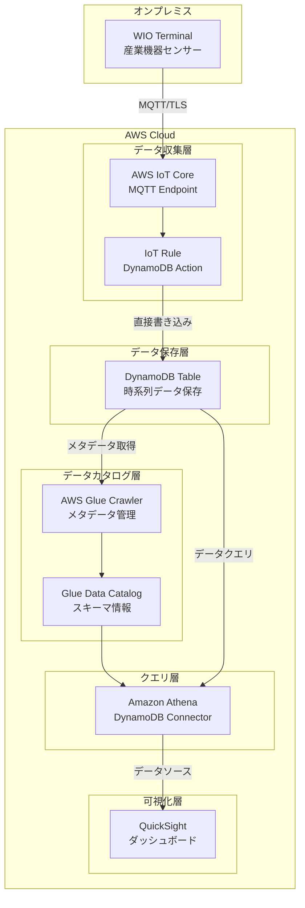

# 設計文書

## 概要

産業機器監視システムのためのAWSクラウドインフラストラクチャを設計する。WIO TerminalからのMQTTデータを受信し、AWS IoT Core、Lambda、DynamoDB、QuickSightを使用してリアルタイム監視システムを構築する。

## アーキテクチャ



## コンポーネントと インターフェース

### 1. AWS IoT Core
- **目的**: WIO TerminalからのMQTTメッセージを受信
- **設定**:
  - MQTTエンドポイント: `{account-id}.iot.{region}.amazonaws.com`
  - ポート: 8883 (MQTT over TLS)
  - トピック: `device/{device-id}/data`

### 2. IoT Rule
- **目的**: 受信データの処理とDynamoDBへの直接書き込み
- **SQL文**: `SELECT *, timestamp() as received_at FROM 'device/+/data'`
- **アクション**: DynamoDB Put Item Action
- **IAMロール**: DynamoDBへの書き込み権限

### 3. DynamoDB Table
- **目的**: 時系列データの永続化
- **テーブル設計**:
  - パーティションキー: `device_id` (String)
  - ソートキー: `timestamp` (Number, Unix timestamp)
  - 属性:
    - `data`: センサーデータ (Map)
    - `received_at`: 受信時刻 (Number)
    - `processed_at`: 処理時刻 (Number)
    - `status`: データ状態 (String: "normal", "warning", "error")

### 4. AWS Glue Crawler
- **目的**: DynamoDBテーブルのメタデータを自動取得
- **実行スケジュール**: 日次または変更検知時
- **出力**: Glue Data Catalogにスキーマ情報を保存

### 5. Amazon Athena with DynamoDB Connector
- **目的**: DynamoDBデータへのSQLクエリ実行
- **コネクタ**: Athena DynamoDB Connector (Lambda関数)
- **S3バケット**: クエリ結果とスピルデータ用
- **設定**:
  - SpillBucket: クエリ結果保存用S3バケット
  - 暗号化: S3およびLambda関数の暗号化設定

### 6. QuickSight DataSource
- **目的**: Athenaを通じたDynamoDBデータの可視化
- **データソースタイプ**: Amazon Athena
- **更新間隔**: 1分（Athenaクエリ実行間隔）
- **ダッシュボード要素**:
  - 時系列グラフ
  - 最新値表示
  - アラート状況

## データモデル

### IoT メッセージフォーマット
```json
{
  "device_id": "wio-terminal-001",
  "timestamp": 1640995200,
  "sensors": {
    "temperature": 25.5,
    "humidity": 60.2,
    "pressure": 1013.25,
    "vibration": 0.05
  },
  "location": "factory-floor-1",
  "battery_level": 85
}
```

### DynamoDB アイテム構造
```json
{
  "device_id": "wio-terminal-001",
  "timestamp": 1640995200,
  "data": {
    "sensors": {
      "temperature": 25.5,
      "humidity": 60.2,
      "pressure": 1013.25,
      "vibration": 0.05
    },
    "location": "factory-floor-1",
    "battery_level": 85
  },
  "received_at": 1640995201,
  "processed_at": 1640995202,
  "status": "normal"
}
```

## 正確性プロパティ

*プロパティとは、システムのすべての有効な実行において真であるべき特性や動作のことです。プロパティは、人間が読める仕様と機械で検証可能な正確性保証の橋渡しとなります。*

### プロパティ 1: データ処理の完全性
*すべての*有効なIoTメッセージに対して、IoT Ruleがデータを受信した場合、タイムスタンプを含む標準化された形式でDynamoDBに直接保存されるべきである
**検証: 要件 1.1, 1.4, 2.1, 2.3, 2.5**

### プロパティ 2: エラーハンドリングの一貫性
*すべての*エラー条件（データ受信失敗、書き込み失敗）に対して、IoT Ruleは適切なエラーログを記録し、必要に応じてデッドレターキューに送信するべきである
**検証: 要件 1.2, 3.2**

### プロパティ 3: データ妥当性検証
*すべての*受信データに対して、IoT RuleのSQL文による基本的な妥当性検証が適用され、無効なデータは適切に処理されるべきである
**検証: 要件 2.4**

### プロパティ 4: データ整合性の保証
*すべての*DynamoDBに書き込まれたデータに対して、Athena DynamoDB Connectorを通じたクエリで同じデータが正確に取得可能であるべきである
**検証: 要件 3.4**

### プロパティ 5: CDKリソース定義の正確性
*すべての*CDKデプロイメント操作に対して、必要なAWSリソース（IoT Core、DynamoDB、Glue Crawler、Athena Connector、QuickSight）が正しく定義され作成されるべきである
**検証: 要件 5.4**

## エラーハンドリング

### 1. IoT Core エラー
- **接続エラー**: デバイス認証失敗時のログ記録
- **メッセージフォーマットエラー**: 不正なJSONの処理

### 2. Lambda エラー
- **処理エラー**: データ変換失敗時の再試行メカニズム
- **DynamoDB書き込みエラー**: 指数バックオフによる再試行
- **タイムアウト**: 長時間処理の分割

### 3. DynamoDB エラー
- **スロットリング**: 自動スケーリングとバックオフ
- **容量不足**: CloudWatchアラームによる通知

### 4. QuickSight エラー
- **データソース接続エラー**: 自動再接続メカニズム
- **クエリタイムアウト**: クエリ最適化

## テスト戦略

### 単体テスト
- IoT RuleのSQL文の動作検証
- DynamoDB書き込み処理
- Athena DynamoDB Connectorのクエリ実行
- エラーハンドリング機能

### プロパティベーステスト
- 各正確性プロパティに対応するテスト
- ランダムなIoTデータでの動作検証
- 大量データでのスケーラビリティテスト
- 最小100回の反復実行

### 統合テスト
- IoT Core → IoT Rule → DynamoDB の完全フロー
- Athena DynamoDB Connectorのデータクエリ
- QuickSightダッシュボードのデータ表示
- エラー状況での動作確認

### テスト設定
- プロパティテストは最小100回の反復実行
- 各テストは設計文書のプロパティを参照
- タグ形式: **Feature: iot-aws-infrastructure, Property {number}: {property_text}**